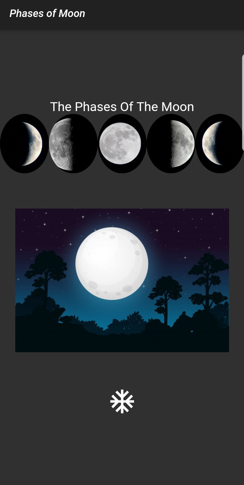

# *Flutter* *Example*

## 	The Phases of the Moon

This project is a Flutter example app.

The screen components, local file reading and web gif reading mechanism was used to within the scope of the project.

 ### 	Which use flutter components
 - Container, Column, Row

 - Fade in Image, Image, Circle Image

    ------

 - Flutter Dark Theme

    - ~~~~dart
      return MaterialApp(
          ...
          darkTheme: ThemeData.dark(),
          ...
      );
      ~~~~
    
    ### App Screen
    
    ------
    
    

> Use this [link](https://flutter.dev/docs/development/ui) for more components... 

